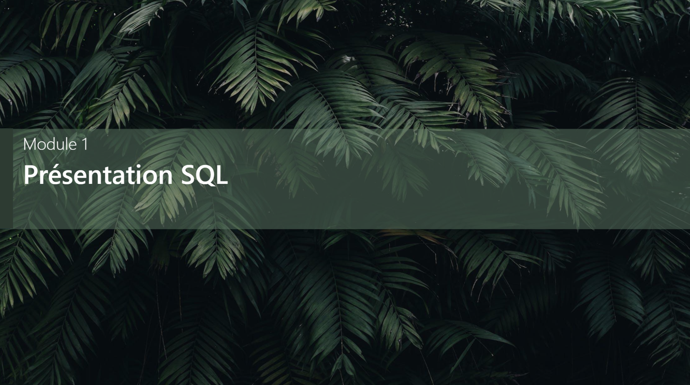
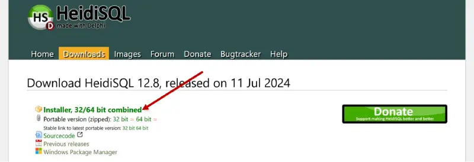
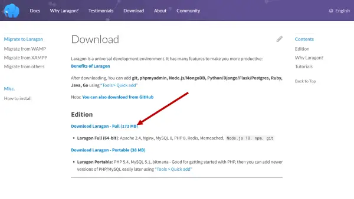
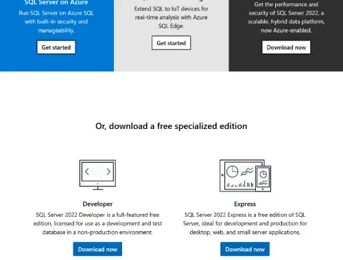

# Module 01 - Présentation SQL
  
 
<a href="../00 Les fichiers PDF - Supports de cours/01 Présentation SQL.pdf">
01 Présentation SQL
</a>  

## heidi SQL

   
 <a href="https://www.heidisql.com/download.php">https://www.heidisql.com/download.php</a>

## Laragon
Pour installer mysql 
avec phpMyAdmin

   
 <a href="https://laragon.org/">https://laragon.org/</a>

## SQL Server & SSMS
SQL Server & **S**erver **M**anagement **S**tudio (SSMS)

   
 <a href="https://www.microsoft.com/fr-fr/sql-server/sql-server-downloads">https://www.microsoft.com/fr-fr/sql-server/sql-server-downloads</a>

Cliquez sur le bouton Installer SSMS à la dernière étape de l'assistant d'installation de SQL Server
Une page Web s'ouvre avec un lien pour télécharger SQL Server Management Studio.