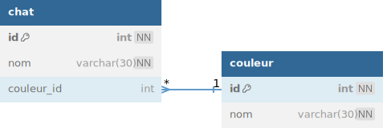

# TP 05 - Le mondes des chats avec une table de jointure

  

# Objectifs :
:one: Création de la base de données **spa**  
:two: Création de la table **chat**  
:three: Creation de la table **couleur**  
:four: Insérer  les données  

 
