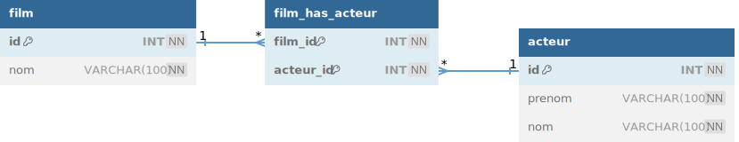
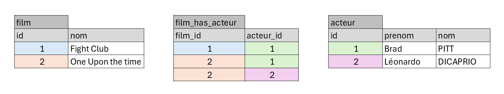

# TP 7 - Film avec acteurs - table de jointure


## Le modèle relationnel


## Les données



# Afficher tous les films et leur acteurs
```mysql
SELECT 
film.nom AS film,
acteur.prenom,
acteur.nom
FROM film
INNER JOIN film_has_acteur  ON film.id = film_has_acteur.film_id
INNER JOIN acteur ON acteur.id = film_has_acteur.acteur_id
```
# Reprendre la base du module 06

:one: Afficher tous les films de Léonardo DI CAPRIO 
 | film | acteur_prenom | acteur_nom |
|--- |--- |--- |
|Once Upon the time |  Leonardo | DICAPRIO |
|Fight Club |  Leonardo | DICAPRIO |

:two: Afficher le nombre de films par acteur 
| acteur_prenom | acteur_nom |  nb_films | 
|--- |--- |--- |
|  Leonardo | DICAPRIO | 1|
| Brad | PITT | 2 |

:three: Ajouter un film :TITANIC   
:four: Trouver le film qui n'a pas d'acteur
| film | 
|--- |
|  TITANIC |

