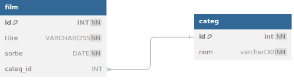

# TP 08 - Les films avec catégories
_Extraire les données avec des jointures_  

| id | titre | sortie | categorie |
|---|---|---|---|
| 1 | STAR WARS | 1977/05/25 | Sciences Fiction |
| 2 | THE MATRIX | 1999/06/23 | Sciences Fiction |
| 3 | PULP FICTION | 1994/10/26 | Thriller |

# Objectifs :
:one: Afficher tous les chats avec la couleur des yeux :
| id | titre | sortie | categorie |
|---|---|---|---|
| 1 | STAR WARS | 1977/05/25 | Sciences Fiction |
| 2 | THE MATRIX | 1999/06/23 | Sciences Fiction |
| 3 | PULP FICTION | 1994/10/26 | Thriller |

:two: Afficher le nombre films par catégories
| categories | nb_films |
|---|---|
| Sciences Fiction | 2 |
| Thriller | 1 |

:three: Faire le script pour supprimer les table <code>DROP TABLE</code>