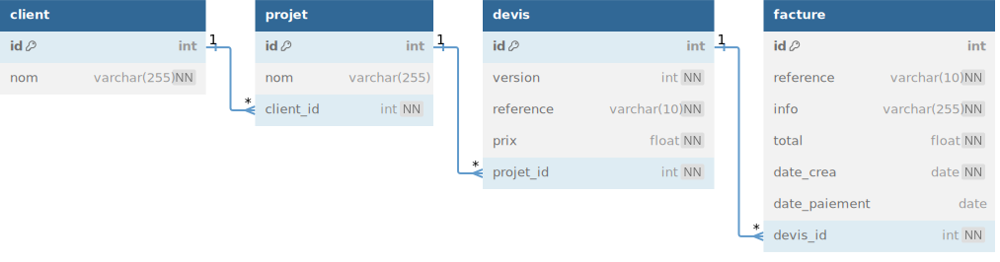

# TP 10 - CRM Customer  Relationship Management
Gestion des devis et factures d'une entreprise
  
**echelle de Scoville 100 000**  :underage:  
[Échelle de Scoville](https://fr.wikipedia.org/wiki/%C3%89chelle_de_Scoville)  
3 piments :cactus::cactus::cactus:  
  

## Le pitch :
Le client a un projet  
En fonction du projet , nous lui proposons plusieurs devis  
Il valide un devis  
Nous lui envoyons une facture  
  

## Modele relationnel


## Les Clients

## Les factures

  
**attention les dates des factures ont été modifiées !** 
   
# les data

```sql
DROP DATABASE IF EXISTS my_crm;
CREATE DATABASE my_crm CHARACTER SET utf8mb4 COLLATE utf8mb4_unicode_ci;
use my_crm;

INSERT INTO client (nom) VALUES 
	('Mairie de Rennes'),
	('Neo Soft'),
	('Sopra'),
	('Accenture'),
	('Amazon');
INSERT INTO projet (nom, client_id) VALUES
	('Création de site internet', 1),
	('Logiciel CRM', 2),
	('Logiciel de devis', 3),
	('Site internet e-commerce', 4),
	('Logiciel ERP', 2),
	('Logiciel gestion de stock',5);

INSERT INTO devis (version,reference, prix, projet_id) VALUES
	('1','DEV2100A', 3000, 1),
	('2','DEV2100B', 5000, 1),
	('1','DEV2100C', 5000, 2),
	('1','DEV2100D', 3000, 3),
	('1','DEV2100E', 5000, 4),
	('1','DEV2100F', 2000, 5),
	('1','DEV2100G', 1000, 6);

INSERT INTO facture (reference,info,total,devis_id,date_crea,date_paiement)	
    VALUES
	('FA001', 'site internet partie 1', 1500, 1, '2023-09-01','2023-10-01'),
	('FA002', 'site internet partie 2', 1500, 1, '2023-09-20',null),
	('FA003', 'logiciel CRM', 5000, 3, '2024-02-01',null),
	('FA004', 'logiciel devis', 3000, 4, '2024-03-03','2024-04-03'),
	('FA005', 'site ecommerce', 5000, 5, '2023-03-01',null),
	('FA006', 'logiciel ERP', 2000, 6, '2023-03-01',null);
```
# Partie 1
##  Créer la base de données  en 4 étape  
  11 - Créer la table client & Ajouter les données de client  
  12 - Créer la table projet & Ajouter les données de projet  
  13 - Créer la table devis & Ajouter les données de devis    
  14 - Créer la table facture & Ajouter les données de facture  
  
 
# Partie 2
:one: Afficher toutes les factures avec le nom des clients  
:two: Afficher le nombre de factures par client  
:three: Afficher le chiffre d'affaire par client  
:four: Afficher le CA total    
:five: Afficher  la somme des factures en attente de paiement   
:six: Afficher les factures en retard de paiment  
:seven: Ajouter une pénalité de 2 euros par jours de retard  

----------------------------------------------------------------

:one: Afficher toutes les factures avec le nom des clients  
| ref | client | info | total | date | paiement | 
|--- |--- |--- |--- |--- |--- |
|FA001|Mairie de Rennes |site internet partie 1	|1500|2023-09-01|2023-10-01|
|FA002|Mairie de Rennes |site internet partie 2	|1500|2023-09-20||	
|FA003|Neo Soft |logiciel CRM|5000|2024-02-01||	
|FA004|Sopra |logiciel devis|3000|2024-03-03|2024-04-03||
|FA005|Accenture |site ecommerce|5000|2023-03-01| |	
|FA006|Neo Soft|	logiciel ERP|2000|2023-03-01| |	   
 
:two: Afficher le nombre de factures par client   
_Afficher 0 factures si il n'y a pas de factures_    
| client | nb_factures|
|--- |--- |
|Mairie de Rennes |2|
|Neo Soft |2|
|Sopra |1|
|Accenture |1 |
|Neo Soft|1|
  
:three: Afficher le chiffre d'affaire par client     
| client | nb_factures|
|--- |--- |
|Mairie de Rennes |3000|
|Neo Soft |7000|
|Sopra |3000|
|Accenture |5000 |
|Neo Soft| |
  
:four: Afficher le CA total    
| ca_total |
|--- |
|18000|
    
:five: Afficher  la somme des factures en attente de paiement   
| total_factures |
|--- |
|13500|
          
:six: Afficher les factures en retard de paiment        
30 jours max  
Avec le nombre de jours de retard      
| facture | nb_jour |
|--- |--- |
|FA0002 |427|
|FA0003 |293|
|FA0005 |630|
|FA0006 |630|  

:seven: Ajouter une pénalité de 2 euros par jours de retard  
  
# Partie 3 réaliser un modèle relationnel
  **[OPTIONEL]**  
:shipit:Réaliser le modèle relationnel sur db diagram  et fournir le prompt  
[db Diagram](https://dbdiagram.io/home)    
  

 

