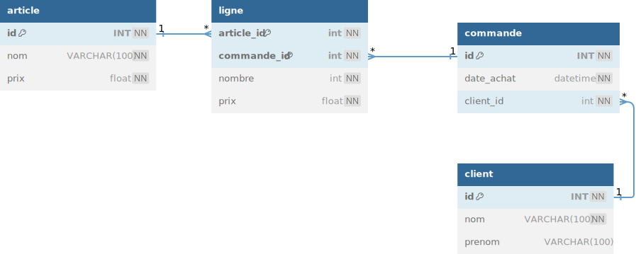

# TP 12 - SITE E-commerce




<table>
<tr>
<td valign=top>

### la table article
| id | nom | prix | 
|----|---|---|
| 1 | PlayStation 5 | 400.00 |
| 2 | X box | 350.00 |
| 3 | Machine à café | 300.00 |
| 4 | PlayStation 3 | 100.00 |

</td><td valign=top>

### la table client
| id | nom | prenom | 
|----|---|---|
| 1 | Brad | PITT |
| 2 | George | Cloney |
| 3 | Jean | DUJARDIN |

</td><td valign=top>

### la table commande
| id | date_achat | client_id | 
|----|---|---|
| 1 | 08/09/2024 | 1 |
</td></tr></table>


:one: Afficher la commande de Brad PITT

# La structure complète de la base & avec les données
```sql
CREATE TABLE client (
  id INT NOT NULL AUTO_INCREMENT,
  nom VARCHAR(100) NOT NULL,
  prenom VARCHAR(100),
  CONSTRAINT pk_client PRIMARY KEY  pk_client(id)
)ENGINE=INNODB;

CREATE TABLE commande (
  id INT NOT NULL AUTO_INCREMENT,
  date_achat DATETIME NOT NULL,
  client_id int NOT NULL,
  CONSTRAINT pk_commande PRIMARY KEY  pk_commande(id)
)ENGINE=INNODB;

CREATE TABLE article (
  id INT NOT NULL AUTO_INCREMENT,
  nom VARCHAR(100) NOT NULL,
  prix float NOT NULL,
   CONSTRAINT pk_article PRIMARY KEY  pk_article(id)
)ENGINE=INNODB;

CREATE TABLE ligne (
  article_id int NOT NULL,
  commande_id int NOT NULL,
  nombre int NOT NULL,
  prix float NOT NULL,
  CONSTRAINT pk_ligne PRIMARY KEY (article_id, commande_id)
)ENGINE=INNODB;

ALTER TABLE commande ADD CONSTRAINT fk_client FOREIGN KEY (client_id) REFERENCES client(id);
ALTER TABLE ligne ADD CONSTRAINT fk_article FOREIGN KEY (article_id) REFERENCES article(id);
ALTER TABLE ligne ADD CONSTRAINT fk_commande FOREIGN KEY (commande_id) REFERENCES commande(id);

########################
# Les Données
########################

-- article
INSERT INTO article (nom,prix) VALUES
('PlayStation 5',	400),
('X box',	350),
('Machine à café',	400),
('PlayStation 3',	100);
-- client
INSERT INTO client (nom,prenom) VALUES
('Brad','PITT'),	
('George','CLONEY'),
('Jean','DUJARDIN');
-- commande
INSERT INTO commande (date_achat,client_id) VALUES('2024/09/08 10:15:00',1);
-- ligne
INSERT INTO ligne (article_id,commande_id,nombre,prix) VALUES
(4,1,2,100),
(3,1,1,300),
(2,1,1,350);
```


# Bonus : pseudo code pour db diagram
  

[db Diagram](https://dbdiagram.io/home) 
**prompt db diagram :**

```
Table client {
  id INT [pk, not null, increment]
  nom VARCHAR(100) [not null]
  prenom VARCHAR(100)
}
Table commande {
  id INT [pk, not null, increment]
  date_achat datetime [not null]
  client_id int [not null] 
}
Table article {
  id INT [pk, not null, increment]
  nom VARCHAR(100) [not null]
  prix float [not null]
}
Table ligne {
  article_id int  [not null,pk]
  commande_id int  [not null,pk]
  nombre int [not null]
  prix float [not null]
}
Ref: "article"."id" < "ligne"."article_id"
Ref: "commande"."id" < "ligne"."commande_id"
Ref: "client"."id" < "commande"."client_id"
```