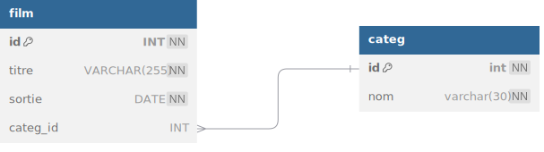

# TP 6 - Les films avec catégories
## :warning: La correction

 



| id | titre | sortie | categorie |
|---|---|---|---|
| 1 | STAR WARS | 1977/05/25 | Sciences Fiction |
| 2 | THE MATRIX | 1999/06/23 | Sciences Fiction |
| 3 | PULP FICTION | 1994/10/26 | Thriller |

# Objectifs :
:one: Création de la base de données **netflix**  
:two: Création de la table **film**  
:three: Création de la table **categ**


```sql

# 1 Création de la base de données
DROP DATABASE IF EXISTS netflix;
CREATE DATABASE netflix CHARACTER SET utf8mb4 COLLATE utf8mb4_unicode_ci;
USE netflix;

# 2 table film
CREATE TABLE film (
    id INT NOT NULL AUTO_INCREMENT,
    titre VARCHAR(255) NOT NULL,
    sortie DATE NOT NULL,
    categ_id INT NULL,
    CONSTRAINT pk_film PRIMARY KEY(id)
) ENGINE=InnoDB; 

# 3 table categ
CREATE TABLE categ (
 id int NOT NULL AUTO_INCREMENT,
 nom VARCHAR(50) NOT NULL,
 CONSTRAINT pk_categ PRIMARY KEY (id)
)ENGINE=INNODB;
```

:four: Insérer  les données
```sql
INSERT INTO categ (nom) VALUES
('SF'),
('Thriller');

INSERT INTO film (titre,sortie,categ_id) VALUES
('STAR WARS','1977/05/25',1),
('THE MATRIX','1999/06/23',1),
('PULP FICTION','1994/10/26',2);
```  

# TESTER 
```sql
USE netflix;
SELECT * FROM film;
```

```sql
USE netflix;
SELECT * FROM categ;
```

# Bonus : pseudo code pour db diagram

  

[db Diagram](https://dbdiagram.io/home) 
**prompt db diagram :**
  
```
Table categ{
  id int [pk,not null, increment]
  nom varchar(30) [not null]
}
Table "film" {
  "id" INT [pk, not null, increment]
  "titre" VARCHAR(255) [not null]
  "sortie" DATE [not null]
  categ_id INT [null]
}
Ref: "categ"."id" < "film"."categ_id"
```


