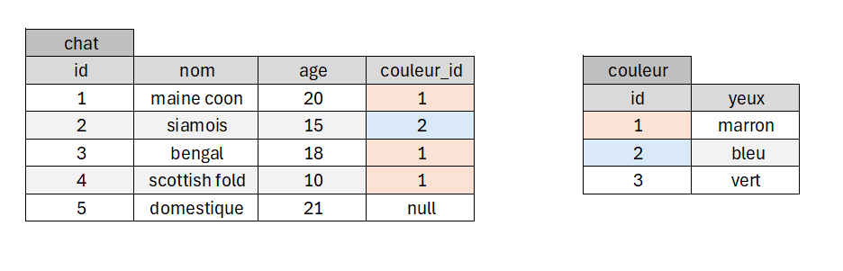
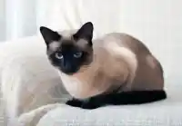
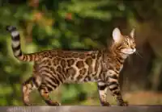

# TP 5 - Le mondes des chats avec une clef étrangère

Prise en main des commandes :  
    
<code>INNER JOIN</code>    
<code>LEFT JOIN</code>    

  

# Objectifs :
:one: Création de la base de données **spa**  
:two: Création de la table **chat**  
:three: Creation de la table **couleur**  
:four: Insérer  les données  

 
