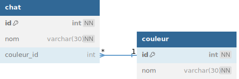

# TP 5 - Le mondes des chats avec une clef étrangère


Prise en main des commandes :  
    
<code>INNER JOIN</code>    
<code>LEFT JOIN</code>    


  


# Objectifs :
:one: Création de la base de données **spa**  
:two: Création de la table **chat**  
:three: Creation de la table **couleur**
```sql
# 1 Création de la base de données spa
DROP DATABASE IF EXISTS spa;
-- CREATION DE LA DATA BASE
CREATE DATABASE spa CHARACTER SET utf8mb4 COLLATE utf8mb4_unicode_ci;
USE spa;

# 2 Création de la table chat  
CREATE TABLE chat (
 id int NOT NULL AUTO_INCREMENT,
 nom VARCHAR(50) NOT NULL,
 couleur_id int NULL, # le champ peut etre null
 CONSTRAINT pk_chat PRIMARY KEY (id)
)ENGINE=INNODB;

# 3 Creation de la table couleur 
CREATE TABLE couleur (
 id int NOT NULL AUTO_INCREMENT,
 nom VARCHAR(50) NOT NULL,
 CONSTRAINT pk_couleur PRIMARY KEY (id)
)ENGINE=INNODB;

ALTER TABLE chat ADD CONSTRAINT fk_couleur FOREIGN KEY (couleur_id) REFERENCES couleur(id);
```
  
:four: Insérer  les données  

 
