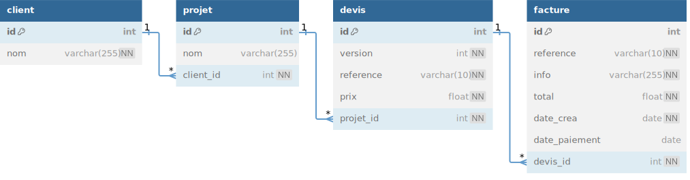

# TP 7 - CRM Customer  Relationship Management
Gestion des devis et factures d'une entreprise
    


  
**echelle de Scoville 100 000**  :underage:  
[Échelle de Scoville](https://fr.wikipedia.org/wiki/%C3%89chelle_de_Scoville)  
3 piments :cactus::cactus::cactus:  
  

## Modele relationnel


## Le pitch :
Le client a un projet  
En fonction du projet , nous lui proposons plusieurs devis  
Il valide un devis  
Nous lui envoyons une facture  
  


## Les Clients
|Client|version|Projet|devis|montant|
|---|---|---|---|---|
|Mairie de Rennes|1|Creation de site internet|DEV2100A|3 000 euros|
|Mairie de Rennes|2|Creation de site internet|DEV2100B|5 000 euros|
|Neo Soft|1|Logiciel CRM|DEV2100C|5 000 euros|
|Sopra|1|Logiciel de devis|DEV2100D|3 000 euros|
|Accenture|1|Site internet ecommerce|DEV2100E|5 000 euros|
|Neo Soft|1|logiciel ERP|DEV2100F|2 000 euros|
|Amazon|1|logiciel Gestion de Stock|DEV2100G|1 000 euros|

## Les factures
|Facture|devis|info|total|Client|date|paiement|
|---|---|---|---|---|---|---|
|FA001|DEV2100A|Site internet partie 1|1 500 euros|Mairie de Rennes|01/09/2023|01/10/2023|
|FA002|DEV2100A|Site internet partie 2|1 500  euros|Marie de Rennes|20/09/2023||
|FA003|DEV2100C|Logiciel CRM|5 000 euros|Neo Soft|01/02/2024||
|FA004|DEV2100D|Logiciel devis|3 000  euros|Sopra|03/03/2024|03/04/2024|
|FA005|DEV2100E|Site internet ecommerce|5 000 euros|Accenture|01/03/2023||
|FA006|DEV2100F|logiciel ERP |2 000 euros|Neo Soft|01/03/2023||
  

   

# Partie 1
- Créer la base de données avec 4 tables 
- Ajouter les données 
```sql
DROP DATABASE IF EXISTS my_crm;
CREATE DATABASE my_crm CHARACTER SET utf8mb4 COLLATE utf8mb4_unicode_ci;
USE my_crm;


CREATE TABLE client (
 id INT NOT NULL AUTO_INCREMENT,
 nom VARCHAR(255) NOT NULL,
 CONSTRAINT pk_client PRIMARY KEY (id)
)ENGINE=INNODB;

CREATE TABLE projet(
 id INT NOT NULL AUTO_INCREMENT,
 client_id INT NOT NULL,
 nom VARCHAR(255) NOT NULL,
 CONSTRAINT pk_projet PRIMARY KEY (id)
)ENGINE=INNODB;

CREATE TABLE devis(
 id INT NOT NULL AUTO_INCREMENT,
 version INT NOT NULL,
 reference VARCHAR(10) NOT NULL,
 prix FLOAT NOT NULL,
 projet_id INT NOT NULL,
 CONSTRAINT pk_devis PRIMARY KEY (id)
)ENGINE=INNODB;

CREATE TABLE facture(
 id INT NOT NULL AUTO_INCREMENT,
 reference VARCHAR(10) NOT NULL,
 info VARCHAR(255) NOT NULL,
 total FLOAT NOT NULL,
 date_crea DATE NOT NULL,
 date_paiement DATE NULL,
 devis_id INT NOT NULL,
 CONSTRAINT pk_facture PRIMARY KEY (id)
)ENGINE=INNODB;

-- fk_client dans table projet
ALTER TABLE projet 
ADD CONSTRAINT fk_client 
FOREIGN KEY projet(client_id) 
REFERENCES client(id);

-- fk_projet dans table devis
ALTER TABLE devis 
ADD CONSTRAINT fk_projets 
FOREIGN KEY devis(projet_id) 
REFERENCES projet(id);

-- fk_devis dans table facture
ALTER TABLE facture 
ADD CONSTRAINT fk_devis 
FOREIGN KEY facture(devis_id) 
REFERENCES devis(id);

###############################
# Ajouter les données  
###############################

INSERT INTO client (nom) VALUES 
	('Mairie de Rennes'),
	('Neo Soft'),
	('Sopra'),
	('Accenture'),
	('Amazon');
INSERT INTO projet (nom, client_id) VALUES
	('Création de site internet', 1),
	('Logiciel CRM', 2),
	('Logiciel de devis', 3),
	('Site internet e-commerce', 4),
	('Logiciel ERP', 2),
	('Logiciel gestion de stock',5);

INSERT INTO devis (version,reference, prix, projet_id) VALUES
	('1','DEV2100A', 3000, 1),
	('2','DEV2100B', 5000, 1),
	('1','DEV2100C', 5000, 2),
	('1','DEV2100D', 3000, 3),
	('1','DEV2100E', 5000, 4),
	('1','DEV2100F', 2000, 5),
	('1','DEV2100G', 1000, 6);

INSERT INTO facture (reference,info,total,devis_id,date_crea,date_paiement)	
    VALUES
	('FA001', 'site internet partie 1', 1500, 1, '2023-09-01','2023-10-01'),
	('FA002', 'site internet partie 2', 1500, 1, '2023-09-20',null),
	('FA003', 'logiciel CRM', 5000, 3, '2024-02-01',null),
	('FA004', 'logiciel devis', 3000, 4, '2024-03-03','2024-04-03'),
	('FA005', 'site ecommerce', 5000, 5, '2023-03-01',null),
	('FA006', 'logiciel ERP', 2000, 6, '2023-03-01',null);
```  
 
# Partie 2
:one: Afficher toutes les factures avec le nom des clients  
:two: Afficher le nombre de factures par client  
:three: Afficher le chiffre d'affaire par client  
:four: Afficher le CA total    
:five: Afficher  la somme des factures en attente de paiement   
:six: Afficher les factures en retard de paiment  
:seven: Ajouter une pénalité de 2 euros par jours de retard  

----------------------------------------------------------------

:one: Afficher toutes les factures avec le nom des clients  
| ref | client | info | total | date | paiement | 
|--- |--- |--- |--- |--- |--- |
|FA001|Mairie de Rennes |site internet partie 1	|1500|2023-09-01|2023-10-01|
|FA002|Mairie de Rennes |site internet partie 2	|1500|2023-09-20||	
|FA003|Neo Soft |logiciel CRM|5000|2024-02-01||	
|FA004|Sopra |logiciel devis|3000|2024-03-03|2024-04-03||
|FA005|Accenture |site ecommerce|5000|2023-03-01| |	
|FA006|Neo Soft|	logiciel ERP|2000|2023-03-01| |	   
 
:two: Afficher le nombre de factures par client   
_Afficher 0 factures si il n'y a pas de factures_    
| client | nb_factures|
|--- |--- |
|Mairie de Rennes |2|
|Neo Soft |2|
|Sopra |1|
|Accenture |1 |
|Amazon |0|
  
:three: Afficher le chiffre d'affaire par client     
| client | nb_factures|
|--- |--- |
|Mairie de Rennes |3000|
|Neo Soft |7000|
|Sopra |3000|
|Accenture |5000 |
|Neo Soft| |
  
:four: Afficher le CA total    
| ca_total |
|--- |
|18000|
    
:five: Afficher  la somme des factures en attente de paiement   
| total_factures |
|--- |
|13500|
          
:six: Afficher les factures en retard de paiment        
30 jours max  
Avec le nombre de jours de retard      
| facture | nb_jour |
|--- |--- |
|FA0002 |413|
|FA0003 |279|
|FA0005 |616|
|FA0006 |616|

:seven: Afficher les factures en retard de paiment **avec le nom du client**   
30 jours max  
Avec le nombre de jours de retard 
|client| facture | nb_jour |
|--- |--- |--- |
|Mairie de Rennes|FA0002 |413|
|Neo Soft|FA0003 |279|
|Accenture|FA0005 |616|
|Neo Soft|FA0006 |616|  

:eight: Ajouter une pénalité de 2 euros par jours de retard  
|client| facture | nb_jour |penalite|
|--- |--- |--- |--- |
|Mairie de Rennes |FA002 |413 |826 euros|
|Neo Soft |FA003 |279 |558 euros|
|Accenture |FA005 |616 |1232 euros|
|Neo Soft |FA006 |616 |1232 euros|

# Partie 3 réaliser un modèle relationnel
  **[OPTIONEL]**  
:shipit:Réaliser le modèle relationnel sur db diagram  et fournir le prompt  
[db Diagram](https://dbdiagram.io/home)    
  

 

