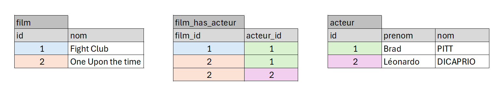

# TP 08 - Film avec acteurs - table de jointures
## :warning: La correction

  


## Le modèle relationnel


## Les données


## Pour rappel voici la structure de la table avec les données
```sql
DROP DATABASE IF EXISTS prime_vdo;
CREATE DATABASE prime_vdo CHARACTER SET utf8mb4 COLLATE utf8mb4_unicode_ci;
USE prime_vdo;

CREATE TABLE film (
  id INT  NOT NULL AUTO_INCREMENT,
  nom VARCHAR(100) NOT NULL,
  CONSTRAINT pk_film PRIMARY KEY(id)
)ENGINE=INNODB;

CREATE TABLE acteur (
  id INT NOT NULL AUTO_INCREMENT,
  prenom VARCHAR(100) NOT NULL,
  nom VARCHAR(100) NOT NULL,
   CONSTRAINT pk_acteur PRIMARY KEY(id)
)ENGINE=INNODB;

CREATE TABLE film_has_acteur (
  film_id INT NOT NULL,
  acteur_id INT NOT NULL,
  CONSTRAINT pk_film_has_acteur PRIMARY KEY (film_id, acteur_id)
)ENGINE=INNODB;

ALTER TABLE film_has_acteur ADD CONSTRAINT fk_acteur FOREIGN KEY (acteur_id) REFERENCES acteur (id);
ALTER TABLE film_has_acteur ADD CONSTRAINT fk_film FOREIGN KEY (film_id) REFERENCES film (id);

##############
## Les données
##############

INSERT INTO acteur (id, prenom, nom) VALUES
(1, 'Brad', 'PITT'),
(2, 'Léonardo', 'Dicaprio');

INSERT INTO film (id, nom) VALUES
(1, 'Fight Club'),
(2, 'Once Upon a time in Hollywood');

INSERT INTO film_has_acteur 
(film_id, acteur_id) 
VALUES 
('1', '1'), 
('2', '1'), 
('2', '2');
```


:one: - Afficher tous les films Léonardo
| film | acteur_prenom | acteur_nom |
|--- |--- |--- |
|Once Upon the time |  Leonardo | DICAPRIO |
|Fight Club |  Leonardo | DICAPRIO |

```sql
SELECT 
film.nom AS film,
acteur.prenom,
acteur.nom
FROM film
INNER JOIN film_has_acteur  ON film.id = film_has_acteur.film_id
INNER JOIN acteur ON acteur.id = film_has_acteur.acteur_id
WHERE acteur_id=2
```
:two: Afficher le nombre de films par acteur
| acteur_prenom | acteur_nom |  nb_films | 
|--- |--- |--- |
|  Leonardo | DICAPRIO | 1|
| Brad | PITT | 2 |

```sql
SELECT 
COUNT(film.id) AS nb_films,
acteur.prenom,
acteur.nom
FROM film
INNER JOIN film_has_acteur  ON film.id = film_has_acteur.film_id
INNER JOIN acteur ON acteur.id = film_has_acteur.acteur_id
GROUP BY (acteur.id);
```

:three: Ajouter un film TITANIC
```sql
INSERT INTO film (nom) VALUES ('TITANIC');
```
:four: - Trouver le film qui n'a pas d'acteur
| film | 
|--- |
|  TITANIC |


```sql
SELECT 
film.nom, 
acteur_id
FROM film
LEFT JOIN film_has_acteur on film.id=film_has_acteur.film_id
WHERE acteur_id IS NULL
```

:five: Ajouter un acteur TOM CRUISE
```sql
INSERT INTO acter (prenom,nom) VALUES ('Brad','PITT');
```

:six: Afficher le nombre de films par acteur en incluant TOM CRUISE
| acteur_prenom | acteur_nom |  nb_films | 
|--- |--- |--- |
|  Leonardo | DICAPRIO | 1|
| Brad | PITT | 2 |
| TOM | CRUISE | 0 |

