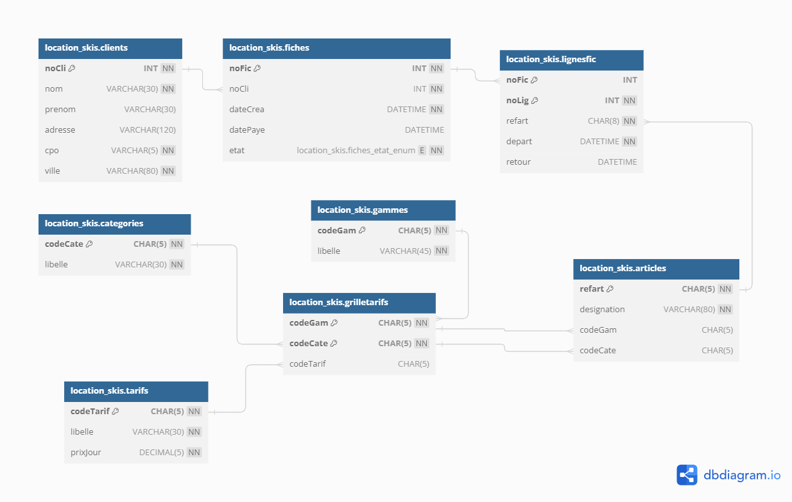

# TP Location ski


# la structure
```sql


-- -----------------------------------------------------
-- Table `clients`
-- -----------------------------------------------------
CREATE TABLE `clients` (
  `noCli` INT NOT NULL,
  `nom` VARCHAR(30) NOT NULL,
  `prenom` VARCHAR(30) NULL,
  `adresse` VARCHAR(120) NULL,
  `cpo` VARCHAR(5) NOT NULL,
  `ville` VARCHAR(80) NOT NULL DEFAULT 'Nantes',
   PRIMARY KEY (`noCli`)
  )
ENGINE = InnoDB;


-- -----------------------------------------------------
-- Table `fiches`
-- -----------------------------------------------------
CREATE TABLE `fiches` (
  `noFic` INT NOT NULL,
  `noCli` INT NOT NULL,
  `dateCrea` DATETIME NOT NULL DEFAULT CURRENT_TIMESTAMP,
  `datePaye` DATETIME NULL,
  `etat` ENUM('EC', 'RE', 'SO') NOT NULL DEFAULT 'EC',
  PRIMARY KEY (`noFic`),
  INDEX `fk_fiches_clients_idx` (`noCli` ASC),
  CONSTRAINT `fk_fiches_clients`
    FOREIGN KEY (`noCli`)
    REFERENCES `clients` (`noCli`)
    ON DELETE CASCADE
    ON UPDATE NO ACTION)
ENGINE = InnoDB;


-- -----------------------------------------------------
-- Table `tarifs`
-- -----------------------------------------------------
CREATE TABLE `tarifs` (
  `codeTarif` CHAR(5) NOT NULL,
  `libelle` VARCHAR(30) NOT NULL,
  `prixJour` DECIMAL(5) UNSIGNED NOT NULL,
  PRIMARY KEY (`codeTarif`),
  UNIQUE INDEX `libelle_UNIQUE` (`libelle` ASC))
ENGINE = InnoDB;


-- -----------------------------------------------------
-- Table `gammes`
-- -----------------------------------------------------
CREATE TABLE `gammes` (
  `codeGam` CHAR(5) NOT NULL,
  `libelle` VARCHAR(45) NOT NULL,
  PRIMARY KEY (`codeGam`),
  UNIQUE INDEX `libelle_UNIQUE` (`libelle` ASC))
ENGINE = InnoDB;


-- -----------------------------------------------------
-- Table `categories`
-- -----------------------------------------------------
CREATE TABLE `categories` (
  `codeCate` CHAR(5) NOT NULL,
  `libelle` VARCHAR(30) NOT NULL,
  PRIMARY KEY (`codeCate`),
  UNIQUE INDEX `libelle_UNIQUE` (`libelle` ASC))
ENGINE = InnoDB;


-- -----------------------------------------------------
-- Table `grilletarifs`
-- -----------------------------------------------------
CREATE TABLE `grilletarifs` (
  `codeGam` CHAR(5) NOT NULL,
  `codeCate` CHAR(5) NOT NULL,
  `codeTarif` CHAR(5) NULL,
  PRIMARY KEY (`codeGam`, `codeCate`),
  INDEX `fk_grilletarifs_tarifs1_idx` (`codeTarif` ASC),
  INDEX `fk_grilletarifs_categories1_idx` (`codeCate` ASC),
  CONSTRAINT `fk_grilletarifs_tarifs1`
    FOREIGN KEY (`codeTarif`)
    REFERENCES `tarifs` (`codeTarif`)
    ON DELETE NO ACTION
    ON UPDATE NO ACTION,
  CONSTRAINT `fk_grilletarifs_gammes1`
    FOREIGN KEY (`codeGam`)
    REFERENCES `gammes` (`codeGam`)
    ON DELETE NO ACTION
    ON UPDATE NO ACTION,
  CONSTRAINT `fk_grilletarifs_categories1`
    FOREIGN KEY (`codeCate`)
    REFERENCES `categories` (`codeCate`)
    ON DELETE NO ACTION
    ON UPDATE NO ACTION)
ENGINE = InnoDB;


-- -----------------------------------------------------
-- Table `articles`
-- -----------------------------------------------------
CREATE TABLE `articles` (
  `refart` CHAR(5) NOT NULL,
  `designation` VARCHAR(80) NOT NULL,
  `codeGam` CHAR(5) NULL,
  `codeCate` CHAR(5) NULL,
  PRIMARY KEY (`refart`),
  INDEX `fk_articles_grilletarifs1_idx` (`codeGam` ASC),
  INDEX `fk_articles_grilletarifs2_idx` (`codeCate` ASC),
  CONSTRAINT `fk_articles_grilletarifs1`
    FOREIGN KEY (`codeGam`)
    REFERENCES `grilletarifs` (`codeGam`)
    ON DELETE NO ACTION
    ON UPDATE NO ACTION,
  CONSTRAINT `fk_articles_grilletarifs2`
    FOREIGN KEY (`codeCate`)
    REFERENCES `grilletarifs` (`codeCate`)
    ON DELETE NO ACTION
    ON UPDATE NO ACTION)
ENGINE = InnoDB;


-- -----------------------------------------------------
-- Table `lignesfic`
-- -----------------------------------------------------
CREATE TABLE `lignesfic` (
  `noFic` INT NOT NULL ,
  `noLig` INT NOT NULL,
  `refart` CHAR(8) NOT NULL,
  `depart` DATETIME NOT NULL DEFAULT CURRENT_TIMESTAMP,
  `retour` DATETIME NULL,

  PRIMARY KEY (`noFic`, `noLig`),
  INDEX `fk_lignesfic_articles1_idx` (`refart` ASC),
  CONSTRAINT `fk_lignesfic_fiches1`
    FOREIGN KEY (`noFic`)
    REFERENCES `fiches` (`noFic`)
    ON DELETE CASCADE
    ON UPDATE NO ACTION,
  CONSTRAINT `fk_lignesfic_articles1`
    FOREIGN KEY (`refart`)
    REFERENCES `articles` (`refart`)
    ON DELETE NO ACTION
    ON UPDATE NO ACTION)
ENGINE = InnoDB;


INSERT INTO `clients` (`noCli`, `nom`, `prenom`, `adresse`, `cpo`, `ville`) VALUES (1, 'Albert', 'Anatole', 'Rue des accacias', '61000', 'Amiens');
INSERT INTO `clients` (`noCli`, `nom`, `prenom`, `adresse`, `cpo`, `ville`) VALUES (2, 'Bernard', 'Barnabé', 'Rue du bar', '1000', 'Bourg en Bresse');
INSERT INTO `clients` (`noCli`, `nom`, `prenom`, `adresse`, `cpo`, `ville`) VALUES (3, 'Dupond', 'Camille', 'Rue Crébillon', '44000', 'Nantes');
INSERT INTO `clients` (`noCli`, `nom`, `prenom`, `adresse`, `cpo`, `ville`) VALUES (4, 'Desmoulin', 'Daniel', 'Rue descendante', '21000', 'Dijon');
INSERT INTO `clients` (`noCli`, `nom`, `prenom`, `adresse`, `cpo`, `ville`) VALUES (5, 'Ernest', 'Etienne', 'Rue de l’échaffaud', '42000', 'Saint Étienne');
INSERT INTO `clients` (`noCli`, `nom`, `prenom`, `adresse`, `cpo`, `ville`) VALUES (6, 'Ferdinand', 'François', 'Rue de la convention', '44100', 'Nantes');
INSERT INTO `clients` (`noCli`, `nom`, `prenom`, `adresse`, `cpo`, `ville`) VALUES (9, 'Dupond', 'Jean', 'Rue des mimosas', '75018', 'Paris');
INSERT INTO `clients` (`noCli`, `nom`, `prenom`, `adresse`, `cpo`, `ville`) VALUES (14, 'Boutaud', 'Sabine', 'Rue des platanes', '75002', 'Paris');


-- -----------------------------------------------------
-- Data for table `fiches`
-- -----------------------------------------------------

INSERT INTO `fiches` (`noFic`, `noCli`, `dateCrea`, `datePaye`, `etat`) VALUES (1001, 14,  DATE_SUB(NOW(),INTERVAL  15 DAY), DATE_SUB(NOW(),INTERVAL  13 DAY),'SO');
INSERT INTO `fiches` (`noFic`, `noCli`, `dateCrea`, `datePaye`, `etat`) VALUES (1002, 4,  DATE_SUB(NOW(),INTERVAL  13 DAY), NULL, 'EC');
INSERT INTO `fiches` (`noFic`, `noCli`, `dateCrea`, `datePaye`, `etat`) VALUES (1003, 1,  DATE_SUB(NOW(),INTERVAL  12 DAY), DATE_SUB(NOW(),INTERVAL  10 DAY),'SO');
INSERT INTO `fiches` (`noFic`, `noCli`, `dateCrea`, `datePaye`, `etat`) VALUES (1004, 6,  DATE_SUB(NOW(),INTERVAL  11 DAY), NULL, 'EC');
INSERT INTO `fiches` (`noFic`, `noCli`, `dateCrea`, `datePaye`, `etat`) VALUES (1005, 3,  DATE_SUB(NOW(),INTERVAL  10 DAY), NULL, 'EC');
INSERT INTO `fiches` (`noFic`, `noCli`, `dateCrea`, `datePaye`, `etat`) VALUES (1006, 9,  DATE_SUB(NOW(),INTERVAL  10 DAY),NULL ,'RE');
INSERT INTO `fiches` (`noFic`, `noCli`,  `dateCrea`,`datePaye`, `etat`) VALUES (1007, 1,  DATE_SUB(NOW(),INTERVAL  3 DAY), NULL, 'EC');
INSERT INTO `fiches` (`noFic`, `noCli`,  `dateCrea`,`datePaye`, `etat`) VALUES (1008, 2,  DATE_SUB(NOW(),INTERVAL  0 DAY), NULL, 'EC');


-- -----------------------------------------------------
-- Data for table `tarifs`
-- -----------------------------------------------------

INSERT INTO `tarifs` (`codeTarif`, `libelle`, `prixJour`) VALUES ('T1', 'Base', 10);
INSERT INTO `tarifs` (`codeTarif`, `libelle`, `prixJour`) VALUES ('T2', 'Chocolat', 15);
INSERT INTO `tarifs` (`codeTarif`, `libelle`, `prixJour`) VALUES ('T3', 'Bronze', 20);
INSERT INTO `tarifs` (`codeTarif`, `libelle`, `prixJour`) VALUES ('T4', 'Argent', 30);
INSERT INTO `tarifs` (`codeTarif`, `libelle`, `prixJour`) VALUES ('T5', 'Or', 50);
INSERT INTO `tarifs` (`codeTarif`, `libelle`, `prixJour`) VALUES ('T6', 'Platine', 90);


-- -----------------------------------------------------
-- Data for table `gammes`
-- -----------------------------------------------------

INSERT INTO `gammes` (`codeGam`, `libelle`) VALUES ('PR', 'Matériel Professionnel');
INSERT INTO `gammes` (`codeGam`, `libelle`) VALUES ('HG', 'Haut de gamme');
INSERT INTO `gammes` (`codeGam`, `libelle`) VALUES ('MG', 'Moyenne gamme');
INSERT INTO `gammes` (`codeGam`, `libelle`) VALUES ('EG', 'Entrée de gamme');


-- -----------------------------------------------------
-- Data for table `categories`
-- -----------------------------------------------------

INSERT INTO `categories` (`codeCate`, `libelle`) VALUES ('MONO', 'Monoski');
INSERT INTO `categories` (`codeCate`, `libelle`) VALUES ('SURF', 'Surf');
INSERT INTO `categories` (`codeCate`, `libelle`) VALUES ('PA', 'Patinette');
INSERT INTO `categories` (`codeCate`, `libelle`) VALUES ('FOA', 'Ski de fond alternatif');
INSERT INTO `categories` (`codeCate`, `libelle`) VALUES ('FOP', 'Ski de fond patineur');
INSERT INTO `categories` (`codeCate`, `libelle`) VALUES ('SA', 'Ski alpin');


-- -----------------------------------------------------
-- Data for table `grilletarifs`
-- -----------------------------------------------------

INSERT INTO `grilletarifs` (`codeGam`, `codeCate`, `codeTarif`) VALUES ('EG', 'MONO', 'T1');
INSERT INTO `grilletarifs` (`codeGam`, `codeCate`, `codeTarif`) VALUES ('MG', 'MONO', 'T2');
INSERT INTO `grilletarifs` (`codeGam`, `codeCate`, `codeTarif`) VALUES ('EG', 'SURF', 'T1');
INSERT INTO `grilletarifs` (`codeGam`, `codeCate`, `codeTarif`) VALUES ('MG', 'SURF', 'T2');
INSERT INTO `grilletarifs` (`codeGam`, `codeCate`, `codeTarif`) VALUES ('HG', 'SURF', 'T3');
INSERT INTO `grilletarifs` (`codeGam`, `codeCate`, `codeTarif`) VALUES ('PR', 'SURF', 'T5');
INSERT INTO `grilletarifs` (`codeGam`, `codeCate`, `codeTarif`) VALUES ('EG', 'PA', 'T1');
INSERT INTO `grilletarifs` (`codeGam`, `codeCate`, `codeTarif`) VALUES ('MG', 'PA', 'T2');
INSERT INTO `grilletarifs` (`codeGam`, `codeCate`, `codeTarif`) VALUES ('EG', 'FOA', 'T1');
INSERT INTO `grilletarifs` (`codeGam`, `codeCate`, `codeTarif`) VALUES ('MG', 'FOA', 'T2');
INSERT INTO `grilletarifs` (`codeGam`, `codeCate`, `codeTarif`) VALUES ('HG', 'FOA', 'T4');
INSERT INTO `grilletarifs` (`codeGam`, `codeCate`, `codeTarif`) VALUES ('PR', 'FOA', 'T6');
INSERT INTO `grilletarifs` (`codeGam`, `codeCate`, `codeTarif`) VALUES ('EG', 'FOP', 'T2');
INSERT INTO `grilletarifs` (`codeGam`, `codeCate`, `codeTarif`) VALUES ('MG', 'FOP', 'T3');
INSERT INTO `grilletarifs` (`codeGam`, `codeCate`, `codeTarif`) VALUES ('HG', 'FOP', 'T4');
INSERT INTO `grilletarifs` (`codeGam`, `codeCate`, `codeTarif`) VALUES ('PR', 'FOP', 'T6');
INSERT INTO `grilletarifs` (`codeGam`, `codeCate`, `codeTarif`) VALUES ('EG', 'SA', 'T1');
INSERT INTO `grilletarifs` (`codeGam`, `codeCate`, `codeTarif`) VALUES ('MG', 'SA', 'T2');
INSERT INTO `grilletarifs` (`codeGam`, `codeCate`, `codeTarif`) VALUES ('HG', 'SA', 'T4');
INSERT INTO `grilletarifs` (`codeGam`, `codeCate`, `codeTarif`) VALUES ('PR', 'SA', 'T6');


-- -----------------------------------------------------
-- Data for table `articles`
-- -----------------------------------------------------

INSERT INTO `articles` (`refart`, `designation`, `codeGam`, `codeCate`) VALUES ('F01', 'Fischer Cruiser', 'EG', 'FOA');
INSERT INTO `articles` (`refart`, `designation`, `codeGam`, `codeCate`) VALUES ('F02', 'Fischer Cruiser', 'EG', 'FOA');
INSERT INTO `articles` (`refart`, `designation`, `codeGam`, `codeCate`) VALUES ('F03', 'Fischer Cruiser', 'EG', 'FOA');
INSERT INTO `articles` (`refart`, `designation`, `codeGam`, `codeCate`) VALUES ('F04', 'Fischer Cruiser', 'EG', 'FOA');
INSERT INTO `articles` (`refart`, `designation`, `codeGam`, `codeCate`) VALUES ('F05', 'Fischer Cruiser', 'EG', 'FOA');
INSERT INTO `articles` (`refart`, `designation`, `codeGam`, `codeCate`) VALUES ('F10', 'Fischer Sporty Crown', 'MG', 'FOA');
INSERT INTO `articles` (`refart`, `designation`, `codeGam`, `codeCate`) VALUES ('F20', 'Fischer RCS Classic GOLD', 'PR', 'FOA');
INSERT INTO `articles` (`refart`, `designation`, `codeGam`, `codeCate`) VALUES ('F21', 'Fischer RCS Classic GOLD', 'PR', 'FOA');
INSERT INTO `articles` (`refart`, `designation`, `codeGam`, `codeCate`) VALUES ('F22', 'Fischer RCS Classic GOLD', 'PR', 'FOA');
INSERT INTO `articles` (`refart`, `designation`, `codeGam`, `codeCate`) VALUES ('F23', 'Fischer RCS Classic GOLD', 'PR', 'FOA');
INSERT INTO `articles` (`refart`, `designation`, `codeGam`, `codeCate`) VALUES ('F50', 'Fischer SOSSkating VASA', 'HG', 'FOP');
INSERT INTO `articles` (`refart`, `designation`, `codeGam`, `codeCate`) VALUES ('F60', 'Fischer RCS CARBOLITE Skating', 'PR', 'FOP');
INSERT INTO `articles` (`refart`, `designation`, `codeGam`, `codeCate`) VALUES ('F61', 'Fischer RCS CARBOLITE Skating', 'PR', 'FOP');
INSERT INTO `articles` (`refart`, `designation`, `codeGam`, `codeCate`) VALUES ('F62', 'Fischer RCS CARBOLITE Skating', 'PR', 'FOP');
INSERT INTO `articles` (`refart`, `designation`, `codeGam`, `codeCate`) VALUES ('F63', 'Fischer RCS CARBOLITE Skating', 'PR', 'FOP');
INSERT INTO `articles` (`refart`, `designation`, `codeGam`, `codeCate`) VALUES ('F64', 'Fischer RCS CARBOLITE Skating', 'PR', 'FOP');
INSERT INTO `articles` (`refart`, `designation`, `codeGam`, `codeCate`) VALUES ('P01', 'Décathlon Allegre junior 150', 'EG', 'PA');
INSERT INTO `articles` (`refart`, `designation`, `codeGam`, `codeCate`) VALUES ('P10', 'Fischer mini ski patinette', 'MG', 'PA');
INSERT INTO `articles` (`refart`, `designation`, `codeGam`, `codeCate`) VALUES ('P11', 'Fischer mini ski patinette', 'MG', 'PA');
INSERT INTO `articles` (`refart`, `designation`, `codeGam`, `codeCate`) VALUES ('S01', 'Décathlon Apparition', 'EG', 'SURF');
INSERT INTO `articles` (`refart`, `designation`, `codeGam`, `codeCate`) VALUES ('S02', 'Décathlon Apparition', 'EG', 'SURF');
INSERT INTO `articles` (`refart`, `designation`, `codeGam`, `codeCate`) VALUES ('S03', 'Décathlon Apparition', 'EG', 'SURF');
INSERT INTO `articles` (`refart`, `designation`, `codeGam`, `codeCate`) VALUES ('A01', 'Salomon 24X+Z12', 'EG', 'SA');
INSERT INTO `articles` (`refart`, `designation`, `codeGam`, `codeCate`) VALUES ('A02', 'Salomon 24X+Z12', 'EG', 'SA');
INSERT INTO `articles` (`refart`, `designation`, `codeGam`, `codeCate`) VALUES ('A03', 'Salomon 24X+Z12', 'EG', 'SA');
INSERT INTO `articles` (`refart`, `designation`, `codeGam`, `codeCate`) VALUES ('A04', 'Salomon 24X+Z12', 'EG', 'SA');
INSERT INTO `articles` (`refart`, `designation`, `codeGam`, `codeCate`) VALUES ('A05', 'Salomon 24X+Z12', 'EG', 'SA');
INSERT INTO `articles` (`refart`, `designation`, `codeGam`, `codeCate`) VALUES ('A10', 'Salomon Pro Link Equipe 4S', 'PR', 'SA');
INSERT INTO `articles` (`refart`, `designation`, `codeGam`, `codeCate`) VALUES ('A11', 'Salomon Pro Link Equipe 4S', 'PR', 'SA');
INSERT INTO `articles` (`refart`, `designation`, `codeGam`, `codeCate`) VALUES ('A21', 'Salomon 3V RACE JR+L10', 'PR', 'SA');


-- -----------------------------------------------------
-- Data for table `lignesfic`
-- -----------------------------------------------------

INSERT INTO `lignesfic` (`noFic`, `noLig`, `refart`, `depart`, `retour`) VALUES (1001, 1, 'F05', DATE_SUB(NOW(),INTERVAL  15 DAY), DATE_SUB(NOW(),INTERVAL  13 DAY));
INSERT INTO `lignesfic` (`noFic`, `noLig`, `refart`, `depart`, `retour`) VALUES (1001, 2, 'F50', DATE_SUB(NOW(),INTERVAL  15 DAY), DATE_SUB(NOW(),INTERVAL  14 DAY));
INSERT INTO `lignesfic` (`noFic`, `noLig`, `refart`, `depart`, `retour`) VALUES (1001, 3, 'F60', DATE_SUB(NOW(),INTERVAL  13 DAY), DATE_SUB(NOW(),INTERVAL  13 DAY));
INSERT INTO `lignesfic` (`noFic`, `noLig`, `refart`, `depart`, `retour`) VALUES (1002, 1, 'A03', DATE_SUB(NOW(),INTERVAL  13 DAY), DATE_SUB(NOW(),INTERVAL  9 DAY));
INSERT INTO `lignesfic` (`noFic`, `noLig`, `refart`, `depart`, `retour`) VALUES (1002, 2, 'A04', DATE_SUB(NOW(),INTERVAL  12 DAY), DATE_SUB(NOW(),INTERVAL  7 DAY));
INSERT INTO `lignesfic` (`noFic`, `noLig`, `refart`, `depart`, `retour`) VALUES (1002, 3, 'S03', DATE_SUB(NOW(),INTERVAL  8 DAY), NULL);
INSERT INTO `lignesfic` (`noFic`, `noLig`, `refart`, `depart`, `retour`) VALUES (1003, 1, 'F50', DATE_SUB(NOW(),INTERVAL  12 DAY), DATE_SUB(NOW(),INTERVAL  10 DAY));
INSERT INTO `lignesfic` (`noFic`, `noLig`, `refart`, `depart`, `retour`) VALUES (1003, 2, 'F05', DATE_SUB(NOW(),INTERVAL  12 DAY), DATE_SUB(NOW(),INTERVAL  10 DAY));
INSERT INTO `lignesfic` (`noFic`, `noLig`, `refart`, `depart`, `retour`) VALUES (1004, 1, 'P01', DATE_SUB(NOW(),INTERVAL  6 DAY), NULL);
INSERT INTO `lignesfic` (`noFic`, `noLig`, `refart`, `depart`, `retour`) VALUES (1005, 1, 'F05', DATE_SUB(NOW(),INTERVAL  9 DAY), DATE_SUB(NOW(),INTERVAL  5 DAY));
INSERT INTO `lignesfic` (`noFic`, `noLig`, `refart`, `depart`, `retour`) VALUES (1005, 2, 'F10', DATE_SUB(NOW(),INTERVAL  4 DAY), NULL);
INSERT INTO `lignesfic` (`noFic`, `noLig`, `refart`, `depart`, `retour`) VALUES (1006, 1, 'S01', DATE_SUB(NOW(),INTERVAL  10 DAY), DATE_SUB(NOW(),INTERVAL  9 DAY));
INSERT INTO `lignesfic` (`noFic`, `noLig`, `refart`, `depart`, `retour`) VALUES (1006, 2, 'S02', DATE_SUB(NOW(),INTERVAL  10 DAY), DATE_SUB(NOW(),INTERVAL  9 DAY));
INSERT INTO `lignesfic` (`noFic`, `noLig`, `refart`, `depart`, `retour`) VALUES (1006, 3, 'S03', DATE_SUB(NOW(),INTERVAL  10 DAY), DATE_SUB(NOW(),INTERVAL  9 DAY));
INSERT INTO `lignesfic` (`noFic`, `noLig`, `refart`, `depart`, `retour`) VALUES (1007, 1, 'F50', DATE_SUB(NOW(),INTERVAL  3 DAY), DATE_SUB(NOW(),INTERVAL  2 DAY));
INSERT INTO `lignesfic` (`noFic`, `noLig`, `refart`, `depart`, `retour`) VALUES (1007, 3, 'F60', DATE_SUB(NOW(),INTERVAL  1 DAY), NULL);
INSERT INTO `lignesfic` (`noFic`, `noLig`, `refart`, `depart`, `retour`) VALUES (1007, 2, 'F05', DATE_SUB(NOW(),INTERVAL  3 DAY), NULL);
INSERT INTO `lignesfic` (`noFic`, `noLig`, `refart`, `depart`, `retour`) VALUES (1007, 4, 'S02', DATE_SUB(NOW(),INTERVAL  0 DAY), NULL);
INSERT INTO `lignesfic` (`noFic`, `noLig`, `refart`, `depart`, `retour`) VALUES (1008, 1, 'S01', DATE_SUB(NOW(),INTERVAL  0 DAY), NULL);
```


# Les data
```sql

-- -----------------------------------------------------
-- Data for table `location_skis`.`clients`
-- -----------------------------------------------------
START TRANSACTION;
USE `location_skis`;
INSERT INTO `location_skis`.`clients` (`noCli`, `nom`, `prenom`, `adresse`, `cpo`, `ville`) VALUES (1, 'Albert', 'Anatole', 'Rue des accacias', '61000', 'Amiens');
INSERT INTO `location_skis`.`clients` (`noCli`, `nom`, `prenom`, `adresse`, `cpo`, `ville`) VALUES (2, 'Bernard', 'Barnabé', 'Rue du bar', '1000', 'Bourg en Bresse');
INSERT INTO `location_skis`.`clients` (`noCli`, `nom`, `prenom`, `adresse`, `cpo`, `ville`) VALUES (3, 'Dupond', 'Camille', 'Rue Crébillon', '44000', 'Nantes');
INSERT INTO `location_skis`.`clients` (`noCli`, `nom`, `prenom`, `adresse`, `cpo`, `ville`) VALUES (4, 'Desmoulin', 'Daniel', 'Rue descendante', '21000', 'Dijon');
INSERT INTO `location_skis`.`clients` (`noCli`, `nom`, `prenom`, `adresse`, `cpo`, `ville`) VALUES (5, 'Ernest', 'Etienne', 'Rue de l’échaffaud', '42000', 'Saint Étienne');
INSERT INTO `location_skis`.`clients` (`noCli`, `nom`, `prenom`, `adresse`, `cpo`, `ville`) VALUES (6, 'Ferdinand', 'François', 'Rue de la convention', '44100', 'Nantes');
INSERT INTO `location_skis`.`clients` (`noCli`, `nom`, `prenom`, `adresse`, `cpo`, `ville`) VALUES (9, 'Dupond', 'Jean', 'Rue des mimosas', '75018', 'Paris');
INSERT INTO `location_skis`.`clients` (`noCli`, `nom`, `prenom`, `adresse`, `cpo`, `ville`) VALUES (14, 'Boutaud', 'Sabine', 'Rue des platanes', '75002', 'Paris');

COMMIT;


-- -----------------------------------------------------
-- Data for table `location_skis`.`fiches`
-- -----------------------------------------------------
START TRANSACTION;
USE `location_skis`;
INSERT INTO `location_skis`.`fiches` (`noFic`, `noCli`, `dateCrea`, `datePaye`, `etat`) VALUES (1001, 14,  DATE_SUB(NOW(),INTERVAL  15 DAY), DATE_SUB(NOW(),INTERVAL  13 DAY),'SO');
INSERT INTO `location_skis`.`fiches` (`noFic`, `noCli`, `dateCrea`, `datePaye`, `etat`) VALUES (1002, 4,  DATE_SUB(NOW(),INTERVAL  13 DAY), NULL, 'EC');
INSERT INTO `location_skis`.`fiches` (`noFic`, `noCli`, `dateCrea`, `datePaye`, `etat`) VALUES (1003, 1,  DATE_SUB(NOW(),INTERVAL  12 DAY), DATE_SUB(NOW(),INTERVAL  10 DAY),'SO');
INSERT INTO `location_skis`.`fiches` (`noFic`, `noCli`, `dateCrea`, `datePaye`, `etat`) VALUES (1004, 6,  DATE_SUB(NOW(),INTERVAL  11 DAY), NULL, 'EC');
INSERT INTO `location_skis`.`fiches` (`noFic`, `noCli`, `dateCrea`, `datePaye`, `etat`) VALUES (1005, 3,  DATE_SUB(NOW(),INTERVAL  10 DAY), NULL, 'EC');
INSERT INTO `location_skis`.`fiches` (`noFic`, `noCli`, `dateCrea`, `datePaye`, `etat`) VALUES (1006, 9,  DATE_SUB(NOW(),INTERVAL  10 DAY),NULL ,'RE');
INSERT INTO `location_skis`.`fiches` (`noFic`, `noCli`,  `dateCrea`,`datePaye`, `etat`) VALUES (1007, 1,  DATE_SUB(NOW(),INTERVAL  3 DAY), NULL, 'EC');
INSERT INTO `location_skis`.`fiches` (`noFic`, `noCli`,  `dateCrea`,`datePaye`, `etat`) VALUES (1008, 2,  DATE_SUB(NOW(),INTERVAL  0 DAY), NULL, 'EC');

COMMIT;


-- -----------------------------------------------------
-- Data for table `location_skis`.`tarifs`
-- -----------------------------------------------------
START TRANSACTION;
USE `location_skis`;
INSERT INTO `location_skis`.`tarifs` (`codeTarif`, `libelle`, `prixJour`) VALUES ('T1', 'Base', 10);
INSERT INTO `location_skis`.`tarifs` (`codeTarif`, `libelle`, `prixJour`) VALUES ('T2', 'Chocolat', 15);
INSERT INTO `location_skis`.`tarifs` (`codeTarif`, `libelle`, `prixJour`) VALUES ('T3', 'Bronze', 20);
INSERT INTO `location_skis`.`tarifs` (`codeTarif`, `libelle`, `prixJour`) VALUES ('T4', 'Argent', 30);
INSERT INTO `location_skis`.`tarifs` (`codeTarif`, `libelle`, `prixJour`) VALUES ('T5', 'Or', 50);
INSERT INTO `location_skis`.`tarifs` (`codeTarif`, `libelle`, `prixJour`) VALUES ('T6', 'Platine', 90);

COMMIT;


-- -----------------------------------------------------
-- Data for table `location_skis`.`gammes`
-- -----------------------------------------------------
START TRANSACTION;
USE `location_skis`;
INSERT INTO `location_skis`.`gammes` (`codeGam`, `libelle`) VALUES ('PR', 'Matériel Professionnel');
INSERT INTO `location_skis`.`gammes` (`codeGam`, `libelle`) VALUES ('HG', 'Haut de gamme');
INSERT INTO `location_skis`.`gammes` (`codeGam`, `libelle`) VALUES ('MG', 'Moyenne gamme');
INSERT INTO `location_skis`.`gammes` (`codeGam`, `libelle`) VALUES ('EG', 'Entrée de gamme');

COMMIT;


-- -----------------------------------------------------
-- Data for table `location_skis`.`categories`
-- -----------------------------------------------------
START TRANSACTION;
USE `location_skis`;
INSERT INTO `location_skis`.`categories` (`codeCate`, `libelle`) VALUES ('MONO', 'Monoski');
INSERT INTO `location_skis`.`categories` (`codeCate`, `libelle`) VALUES ('SURF', 'Surf');
INSERT INTO `location_skis`.`categories` (`codeCate`, `libelle`) VALUES ('PA', 'Patinette');
INSERT INTO `location_skis`.`categories` (`codeCate`, `libelle`) VALUES ('FOA', 'Ski de fond alternatif');
INSERT INTO `location_skis`.`categories` (`codeCate`, `libelle`) VALUES ('FOP', 'Ski de fond patineur');
INSERT INTO `location_skis`.`categories` (`codeCate`, `libelle`) VALUES ('SA', 'Ski alpin');

COMMIT;


-- -----------------------------------------------------
-- Data for table `location_skis`.`grilletarifs`
-- -----------------------------------------------------
START TRANSACTION;
USE `location_skis`;
INSERT INTO `location_skis`.`grilletarifs` (`codeGam`, `codeCate`, `codeTarif`) VALUES ('EG', 'MONO', 'T1');
INSERT INTO `location_skis`.`grilletarifs` (`codeGam`, `codeCate`, `codeTarif`) VALUES ('MG', 'MONO', 'T2');
INSERT INTO `location_skis`.`grilletarifs` (`codeGam`, `codeCate`, `codeTarif`) VALUES ('EG', 'SURF', 'T1');
INSERT INTO `location_skis`.`grilletarifs` (`codeGam`, `codeCate`, `codeTarif`) VALUES ('MG', 'SURF', 'T2');
INSERT INTO `location_skis`.`grilletarifs` (`codeGam`, `codeCate`, `codeTarif`) VALUES ('HG', 'SURF', 'T3');
INSERT INTO `location_skis`.`grilletarifs` (`codeGam`, `codeCate`, `codeTarif`) VALUES ('PR', 'SURF', 'T5');
INSERT INTO `location_skis`.`grilletarifs` (`codeGam`, `codeCate`, `codeTarif`) VALUES ('EG', 'PA', 'T1');
INSERT INTO `location_skis`.`grilletarifs` (`codeGam`, `codeCate`, `codeTarif`) VALUES ('MG', 'PA', 'T2');
INSERT INTO `location_skis`.`grilletarifs` (`codeGam`, `codeCate`, `codeTarif`) VALUES ('EG', 'FOA', 'T1');
INSERT INTO `location_skis`.`grilletarifs` (`codeGam`, `codeCate`, `codeTarif`) VALUES ('MG', 'FOA', 'T2');
INSERT INTO `location_skis`.`grilletarifs` (`codeGam`, `codeCate`, `codeTarif`) VALUES ('HG', 'FOA', 'T4');
INSERT INTO `location_skis`.`grilletarifs` (`codeGam`, `codeCate`, `codeTarif`) VALUES ('PR', 'FOA', 'T6');
INSERT INTO `location_skis`.`grilletarifs` (`codeGam`, `codeCate`, `codeTarif`) VALUES ('EG', 'FOP', 'T2');
INSERT INTO `location_skis`.`grilletarifs` (`codeGam`, `codeCate`, `codeTarif`) VALUES ('MG', 'FOP', 'T3');
INSERT INTO `location_skis`.`grilletarifs` (`codeGam`, `codeCate`, `codeTarif`) VALUES ('HG', 'FOP', 'T4');
INSERT INTO `location_skis`.`grilletarifs` (`codeGam`, `codeCate`, `codeTarif`) VALUES ('PR', 'FOP', 'T6');
INSERT INTO `location_skis`.`grilletarifs` (`codeGam`, `codeCate`, `codeTarif`) VALUES ('EG', 'SA', 'T1');
INSERT INTO `location_skis`.`grilletarifs` (`codeGam`, `codeCate`, `codeTarif`) VALUES ('MG', 'SA', 'T2');
INSERT INTO `location_skis`.`grilletarifs` (`codeGam`, `codeCate`, `codeTarif`) VALUES ('HG', 'SA', 'T4');
INSERT INTO `location_skis`.`grilletarifs` (`codeGam`, `codeCate`, `codeTarif`) VALUES ('PR', 'SA', 'T6');

COMMIT;


-- -----------------------------------------------------
-- Data for table `location_skis`.`articles`
-- -----------------------------------------------------
START TRANSACTION;
USE `location_skis`;
INSERT INTO `location_skis`.`articles` (`refart`, `designation`, `codeGam`, `codeCate`) VALUES ('F01', 'Fischer Cruiser', 'EG', 'FOA');
INSERT INTO `location_skis`.`articles` (`refart`, `designation`, `codeGam`, `codeCate`) VALUES ('F02', 'Fischer Cruiser', 'EG', 'FOA');
INSERT INTO `location_skis`.`articles` (`refart`, `designation`, `codeGam`, `codeCate`) VALUES ('F03', 'Fischer Cruiser', 'EG', 'FOA');
INSERT INTO `location_skis`.`articles` (`refart`, `designation`, `codeGam`, `codeCate`) VALUES ('F04', 'Fischer Cruiser', 'EG', 'FOA');
INSERT INTO `location_skis`.`articles` (`refart`, `designation`, `codeGam`, `codeCate`) VALUES ('F05', 'Fischer Cruiser', 'EG', 'FOA');
INSERT INTO `location_skis`.`articles` (`refart`, `designation`, `codeGam`, `codeCate`) VALUES ('F10', 'Fischer Sporty Crown', 'MG', 'FOA');
INSERT INTO `location_skis`.`articles` (`refart`, `designation`, `codeGam`, `codeCate`) VALUES ('F20', 'Fischer RCS Classic GOLD', 'PR', 'FOA');
INSERT INTO `location_skis`.`articles` (`refart`, `designation`, `codeGam`, `codeCate`) VALUES ('F21', 'Fischer RCS Classic GOLD', 'PR', 'FOA');
INSERT INTO `location_skis`.`articles` (`refart`, `designation`, `codeGam`, `codeCate`) VALUES ('F22', 'Fischer RCS Classic GOLD', 'PR', 'FOA');
INSERT INTO `location_skis`.`articles` (`refart`, `designation`, `codeGam`, `codeCate`) VALUES ('F23', 'Fischer RCS Classic GOLD', 'PR', 'FOA');
INSERT INTO `location_skis`.`articles` (`refart`, `designation`, `codeGam`, `codeCate`) VALUES ('F50', 'Fischer SOSSkating VASA', 'HG', 'FOP');
INSERT INTO `location_skis`.`articles` (`refart`, `designation`, `codeGam`, `codeCate`) VALUES ('F60', 'Fischer RCS CARBOLITE Skating', 'PR', 'FOP');
INSERT INTO `location_skis`.`articles` (`refart`, `designation`, `codeGam`, `codeCate`) VALUES ('F61', 'Fischer RCS CARBOLITE Skating', 'PR', 'FOP');
INSERT INTO `location_skis`.`articles` (`refart`, `designation`, `codeGam`, `codeCate`) VALUES ('F62', 'Fischer RCS CARBOLITE Skating', 'PR', 'FOP');
INSERT INTO `location_skis`.`articles` (`refart`, `designation`, `codeGam`, `codeCate`) VALUES ('F63', 'Fischer RCS CARBOLITE Skating', 'PR', 'FOP');
INSERT INTO `location_skis`.`articles` (`refart`, `designation`, `codeGam`, `codeCate`) VALUES ('F64', 'Fischer RCS CARBOLITE Skating', 'PR', 'FOP');
INSERT INTO `location_skis`.`articles` (`refart`, `designation`, `codeGam`, `codeCate`) VALUES ('P01', 'Décathlon Allegre junior 150', 'EG', 'PA');
INSERT INTO `location_skis`.`articles` (`refart`, `designation`, `codeGam`, `codeCate`) VALUES ('P10', 'Fischer mini ski patinette', 'MG', 'PA');
INSERT INTO `location_skis`.`articles` (`refart`, `designation`, `codeGam`, `codeCate`) VALUES ('P11', 'Fischer mini ski patinette', 'MG', 'PA');
INSERT INTO `location_skis`.`articles` (`refart`, `designation`, `codeGam`, `codeCate`) VALUES ('S01', 'Décathlon Apparition', 'EG', 'SURF');
INSERT INTO `location_skis`.`articles` (`refart`, `designation`, `codeGam`, `codeCate`) VALUES ('S02', 'Décathlon Apparition', 'EG', 'SURF');
INSERT INTO `location_skis`.`articles` (`refart`, `designation`, `codeGam`, `codeCate`) VALUES ('S03', 'Décathlon Apparition', 'EG', 'SURF');
INSERT INTO `location_skis`.`articles` (`refart`, `designation`, `codeGam`, `codeCate`) VALUES ('A01', 'Salomon 24X+Z12', 'EG', 'SA');
INSERT INTO `location_skis`.`articles` (`refart`, `designation`, `codeGam`, `codeCate`) VALUES ('A02', 'Salomon 24X+Z12', 'EG', 'SA');
INSERT INTO `location_skis`.`articles` (`refart`, `designation`, `codeGam`, `codeCate`) VALUES ('A03', 'Salomon 24X+Z12', 'EG', 'SA');
INSERT INTO `location_skis`.`articles` (`refart`, `designation`, `codeGam`, `codeCate`) VALUES ('A04', 'Salomon 24X+Z12', 'EG', 'SA');
INSERT INTO `location_skis`.`articles` (`refart`, `designation`, `codeGam`, `codeCate`) VALUES ('A05', 'Salomon 24X+Z12', 'EG', 'SA');
INSERT INTO `location_skis`.`articles` (`refart`, `designation`, `codeGam`, `codeCate`) VALUES ('A10', 'Salomon Pro Link Equipe 4S', 'PR', 'SA');
INSERT INTO `location_skis`.`articles` (`refart`, `designation`, `codeGam`, `codeCate`) VALUES ('A11', 'Salomon Pro Link Equipe 4S', 'PR', 'SA');
INSERT INTO `location_skis`.`articles` (`refart`, `designation`, `codeGam`, `codeCate`) VALUES ('A21', 'Salomon 3V RACE JR+L10', 'PR', 'SA');

COMMIT;


-- -----------------------------------------------------
-- Data for table `location_skis`.`lignesfic`
-- -----------------------------------------------------
START TRANSACTION;
USE `location_skis`;
INSERT INTO `location_skis`.`lignesfic` (`noFic`, `noLig`, `refart`, `depart`, `retour`) VALUES (1001, 1, 'F05', DATE_SUB(NOW(),INTERVAL  15 DAY), DATE_SUB(NOW(),INTERVAL  13 DAY));
INSERT INTO `location_skis`.`lignesfic` (`noFic`, `noLig`, `refart`, `depart`, `retour`) VALUES (1001, 2, 'F50', DATE_SUB(NOW(),INTERVAL  15 DAY), DATE_SUB(NOW(),INTERVAL  14 DAY));
INSERT INTO `location_skis`.`lignesfic` (`noFic`, `noLig`, `refart`, `depart`, `retour`) VALUES (1001, 3, 'F60', DATE_SUB(NOW(),INTERVAL  13 DAY), DATE_SUB(NOW(),INTERVAL  13 DAY));
INSERT INTO `location_skis`.`lignesfic` (`noFic`, `noLig`, `refart`, `depart`, `retour`) VALUES (1002, 1, 'A03', DATE_SUB(NOW(),INTERVAL  13 DAY), DATE_SUB(NOW(),INTERVAL  9 DAY));
INSERT INTO `location_skis`.`lignesfic` (`noFic`, `noLig`, `refart`, `depart`, `retour`) VALUES (1002, 2, 'A04', DATE_SUB(NOW(),INTERVAL  12 DAY), DATE_SUB(NOW(),INTERVAL  7 DAY));
INSERT INTO `location_skis`.`lignesfic` (`noFic`, `noLig`, `refart`, `depart`, `retour`) VALUES (1002, 3, 'S03', DATE_SUB(NOW(),INTERVAL  8 DAY), NULL);
INSERT INTO `location_skis`.`lignesfic` (`noFic`, `noLig`, `refart`, `depart`, `retour`) VALUES (1003, 1, 'F50', DATE_SUB(NOW(),INTERVAL  12 DAY), DATE_SUB(NOW(),INTERVAL  10 DAY));
INSERT INTO `location_skis`.`lignesfic` (`noFic`, `noLig`, `refart`, `depart`, `retour`) VALUES (1003, 2, 'F05', DATE_SUB(NOW(),INTERVAL  12 DAY), DATE_SUB(NOW(),INTERVAL  10 DAY));
INSERT INTO `location_skis`.`lignesfic` (`noFic`, `noLig`, `refart`, `depart`, `retour`) VALUES (1004, 1, 'P01', DATE_SUB(NOW(),INTERVAL  6 DAY), NULL);
INSERT INTO `location_skis`.`lignesfic` (`noFic`, `noLig`, `refart`, `depart`, `retour`) VALUES (1005, 1, 'F05', DATE_SUB(NOW(),INTERVAL  9 DAY), DATE_SUB(NOW(),INTERVAL  5 DAY));
INSERT INTO `location_skis`.`lignesfic` (`noFic`, `noLig`, `refart`, `depart`, `retour`) VALUES (1005, 2, 'F10', DATE_SUB(NOW(),INTERVAL  4 DAY), NULL);
INSERT INTO `location_skis`.`lignesfic` (`noFic`, `noLig`, `refart`, `depart`, `retour`) VALUES (1006, 1, 'S01', DATE_SUB(NOW(),INTERVAL  10 DAY), DATE_SUB(NOW(),INTERVAL  9 DAY));
INSERT INTO `location_skis`.`lignesfic` (`noFic`, `noLig`, `refart`, `depart`, `retour`) VALUES (1006, 2, 'S02', DATE_SUB(NOW(),INTERVAL  10 DAY), DATE_SUB(NOW(),INTERVAL  9 DAY));
INSERT INTO `location_skis`.`lignesfic` (`noFic`, `noLig`, `refart`, `depart`, `retour`) VALUES (1006, 3, 'S03', DATE_SUB(NOW(),INTERVAL  10 DAY), DATE_SUB(NOW(),INTERVAL  9 DAY));
INSERT INTO `location_skis`.`lignesfic` (`noFic`, `noLig`, `refart`, `depart`, `retour`) VALUES (1007, 1, 'F50', DATE_SUB(NOW(),INTERVAL  3 DAY), DATE_SUB(NOW(),INTERVAL  2 DAY));
INSERT INTO `location_skis`.`lignesfic` (`noFic`, `noLig`, `refart`, `depart`, `retour`) VALUES (1007, 3, 'F60', DATE_SUB(NOW(),INTERVAL  1 DAY), NULL);
INSERT INTO `location_skis`.`lignesfic` (`noFic`, `noLig`, `refart`, `depart`, `retour`) VALUES (1007, 2, 'F05', DATE_SUB(NOW(),INTERVAL  3 DAY), NULL);
INSERT INTO `location_skis`.`lignesfic` (`noFic`, `noLig`, `refart`, `depart`, `retour`) VALUES (1007, 4, 'S02', DATE_SUB(NOW(),INTERVAL  0 DAY), NULL);
INSERT INTO `location_skis`.`lignesfic` (`noFic`, `noLig`, `refart`, `depart`, `retour`) VALUES (1008, 1, 'S01', DATE_SUB(NOW(),INTERVAL  0 DAY), NULL);

COMMIT;

```

[question](location-1.pdf)

