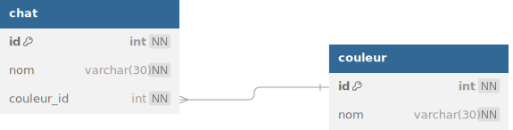

# TP 05 - Le mondes des chats avec une table de jointure
## :warning: La correction

  




# Objectifs :
:one: Création de la base de données **spa**  
:two: Création de la table **chat**  
:three: Creation de la table **couleur**  
```sql
# 1 Création de la base de données spa
DROP DATABASE IF EXISTS spa;
-- CREATION DE LA DATA BASE
CREATE DATABASE spa CHARACTER SET utf8mb4 COLLATE utf8mb4_unicode_ci;
USE spa;

# 2 Création de la table chat  
CREATE TABLE chat (
 id int NOT NULL AUTO_INCREMENT,
 nom VARCHAR(50) NOT NULL,
 couleur_id int NOT NULL,
 CONSTRAINT pk_chat PRIMARY KEY (id)
)ENGINE=INNODB;

# 3 Creation de la table couleur 
CREATE TABLE couleur (
 id int NOT NULL AUTO_INCREMENT,
 nom VARCHAR(50) NOT NULL,
 CONSTRAINT pk_couleur PRIMARY KEY (id)
)ENGINE=INNODB;

ALTER TABLE chat ADD CONSTRAINT fk_couleur FOREIGN KEY (couleur_id) REFERENCES couleur(id);
```

:four: Insérer  les données  
```sql
# 1 on commence par la table couleur
INSERT INTO couleur (nom) VALUES
('marron'),
('bleu');

# 1 ensuite la table chat
INSERT INTO chat (nom,couleur_id) VALUES
('maine coon',1),
('siaimois',2),
('bengal',1),
('Scottish Fold',1);
```

# BONUS Le prompt de dbDiagram
  https://dbdiagram.io/home  
  
```
Table couleur{
  id int [pk,not null, increment]
  nom varchar(30) [not null]
}

Table chat{
  id int [pk,not null, increment]
  nom varchar(30) [not null]
  couleur_id int [not null]
}

Ref: "couleur"."id" < "chat"."couleur_id"
```

# Je teste et j'affiche
```mysql
SELECT 
chat.nom as chat,
couleur.nom as couleur
FROM chat
INNER JOIN couleur 
ON chat.couleur_id = couleur.id
```